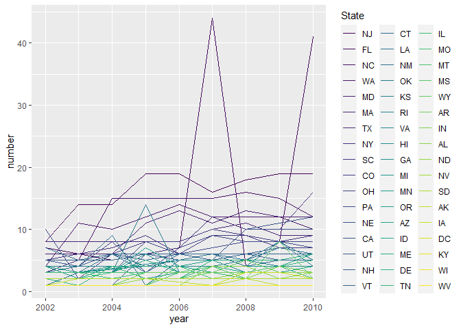

PubH_7462_HW2_Shen0464
================
You Shan Shen
2022/2/6

3.1 Data Exploration & Cleaning (10pts)

3.2 Data Description (10pts)

``` r
number_row <- brfss_smart_df %>% nrow()
number_col <- brfss_smart_df %>% ncol()
year_level <- length(unique(brfss_smart_df$year))
response_level <- length(unique(brfss_smart_df$response))
number_state <- length(unique(brfss_smart_df$state))
number_county <- length(unique(brfss_smart_df$county))
```

2002-2010. BRFSS SMART County Prevalence contains 10625 observations and
6 variables. Each observation is defined as a data about a U.S. resident
regarding their health-related risk behaviors, chronic health
conditions, and use of preventive services.

The definition of variables in 3.1:

Year: The survey conduct in 9 different numbers of year.

Response: There are 5 levels response from an observation.

State: Observations are from 51 different states in US.

County: Observations are from 51 different counties in US.

Sample size: the number of sample from a specific year, response, state,
and county.

Proportion of response: the proportion of sample from a specific level
of response according to year, state, and county in percentage.

3.3 Do Data Science (50pts) 3.3.1 In the year 2004, which states were
observed at 6 locations? (10pts)

``` r
library(gt)

brfss_smart_df %>% 
  filter(year %in% '2004') %>% 
  dplyr::select( state, county ) %>%
  group_by( state) %>% 
  distinct( county , .keep_all = TRUE) %>%
  summarize(n = n() ) %>%
  filter(n == 6) %>%
  gt()
```

<div id="jrwdoojvzp" style="overflow-x:auto;overflow-y:auto;width:auto;height:auto;">
<style>html {
  font-family: -apple-system, BlinkMacSystemFont, 'Segoe UI', Roboto, Oxygen, Ubuntu, Cantarell, 'Helvetica Neue', 'Fira Sans', 'Droid Sans', Arial, sans-serif;
}

#jrwdoojvzp .gt_table {
  display: table;
  border-collapse: collapse;
  margin-left: auto;
  margin-right: auto;
  color: #333333;
  font-size: 16px;
  font-weight: normal;
  font-style: normal;
  background-color: #FFFFFF;
  width: auto;
  border-top-style: solid;
  border-top-width: 2px;
  border-top-color: #A8A8A8;
  border-right-style: none;
  border-right-width: 2px;
  border-right-color: #D3D3D3;
  border-bottom-style: solid;
  border-bottom-width: 2px;
  border-bottom-color: #A8A8A8;
  border-left-style: none;
  border-left-width: 2px;
  border-left-color: #D3D3D3;
}

#jrwdoojvzp .gt_heading {
  background-color: #FFFFFF;
  text-align: center;
  border-bottom-color: #FFFFFF;
  border-left-style: none;
  border-left-width: 1px;
  border-left-color: #D3D3D3;
  border-right-style: none;
  border-right-width: 1px;
  border-right-color: #D3D3D3;
}

#jrwdoojvzp .gt_title {
  color: #333333;
  font-size: 125%;
  font-weight: initial;
  padding-top: 4px;
  padding-bottom: 4px;
  border-bottom-color: #FFFFFF;
  border-bottom-width: 0;
}

#jrwdoojvzp .gt_subtitle {
  color: #333333;
  font-size: 85%;
  font-weight: initial;
  padding-top: 0;
  padding-bottom: 6px;
  border-top-color: #FFFFFF;
  border-top-width: 0;
}

#jrwdoojvzp .gt_bottom_border {
  border-bottom-style: solid;
  border-bottom-width: 2px;
  border-bottom-color: #D3D3D3;
}

#jrwdoojvzp .gt_col_headings {
  border-top-style: solid;
  border-top-width: 2px;
  border-top-color: #D3D3D3;
  border-bottom-style: solid;
  border-bottom-width: 2px;
  border-bottom-color: #D3D3D3;
  border-left-style: none;
  border-left-width: 1px;
  border-left-color: #D3D3D3;
  border-right-style: none;
  border-right-width: 1px;
  border-right-color: #D3D3D3;
}

#jrwdoojvzp .gt_col_heading {
  color: #333333;
  background-color: #FFFFFF;
  font-size: 100%;
  font-weight: normal;
  text-transform: inherit;
  border-left-style: none;
  border-left-width: 1px;
  border-left-color: #D3D3D3;
  border-right-style: none;
  border-right-width: 1px;
  border-right-color: #D3D3D3;
  vertical-align: bottom;
  padding-top: 5px;
  padding-bottom: 6px;
  padding-left: 5px;
  padding-right: 5px;
  overflow-x: hidden;
}

#jrwdoojvzp .gt_column_spanner_outer {
  color: #333333;
  background-color: #FFFFFF;
  font-size: 100%;
  font-weight: normal;
  text-transform: inherit;
  padding-top: 0;
  padding-bottom: 0;
  padding-left: 4px;
  padding-right: 4px;
}

#jrwdoojvzp .gt_column_spanner_outer:first-child {
  padding-left: 0;
}

#jrwdoojvzp .gt_column_spanner_outer:last-child {
  padding-right: 0;
}

#jrwdoojvzp .gt_column_spanner {
  border-bottom-style: solid;
  border-bottom-width: 2px;
  border-bottom-color: #D3D3D3;
  vertical-align: bottom;
  padding-top: 5px;
  padding-bottom: 5px;
  overflow-x: hidden;
  display: inline-block;
  width: 100%;
}

#jrwdoojvzp .gt_group_heading {
  padding: 8px;
  color: #333333;
  background-color: #FFFFFF;
  font-size: 100%;
  font-weight: initial;
  text-transform: inherit;
  border-top-style: solid;
  border-top-width: 2px;
  border-top-color: #D3D3D3;
  border-bottom-style: solid;
  border-bottom-width: 2px;
  border-bottom-color: #D3D3D3;
  border-left-style: none;
  border-left-width: 1px;
  border-left-color: #D3D3D3;
  border-right-style: none;
  border-right-width: 1px;
  border-right-color: #D3D3D3;
  vertical-align: middle;
}

#jrwdoojvzp .gt_empty_group_heading {
  padding: 0.5px;
  color: #333333;
  background-color: #FFFFFF;
  font-size: 100%;
  font-weight: initial;
  border-top-style: solid;
  border-top-width: 2px;
  border-top-color: #D3D3D3;
  border-bottom-style: solid;
  border-bottom-width: 2px;
  border-bottom-color: #D3D3D3;
  vertical-align: middle;
}

#jrwdoojvzp .gt_from_md > :first-child {
  margin-top: 0;
}

#jrwdoojvzp .gt_from_md > :last-child {
  margin-bottom: 0;
}

#jrwdoojvzp .gt_row {
  padding-top: 8px;
  padding-bottom: 8px;
  padding-left: 5px;
  padding-right: 5px;
  margin: 10px;
  border-top-style: solid;
  border-top-width: 1px;
  border-top-color: #D3D3D3;
  border-left-style: none;
  border-left-width: 1px;
  border-left-color: #D3D3D3;
  border-right-style: none;
  border-right-width: 1px;
  border-right-color: #D3D3D3;
  vertical-align: middle;
  overflow-x: hidden;
}

#jrwdoojvzp .gt_stub {
  color: #333333;
  background-color: #FFFFFF;
  font-size: 100%;
  font-weight: initial;
  text-transform: inherit;
  border-right-style: solid;
  border-right-width: 2px;
  border-right-color: #D3D3D3;
  padding-left: 12px;
}

#jrwdoojvzp .gt_summary_row {
  color: #333333;
  background-color: #FFFFFF;
  text-transform: inherit;
  padding-top: 8px;
  padding-bottom: 8px;
  padding-left: 5px;
  padding-right: 5px;
}

#jrwdoojvzp .gt_first_summary_row {
  padding-top: 8px;
  padding-bottom: 8px;
  padding-left: 5px;
  padding-right: 5px;
  border-top-style: solid;
  border-top-width: 2px;
  border-top-color: #D3D3D3;
}

#jrwdoojvzp .gt_grand_summary_row {
  color: #333333;
  background-color: #FFFFFF;
  text-transform: inherit;
  padding-top: 8px;
  padding-bottom: 8px;
  padding-left: 5px;
  padding-right: 5px;
}

#jrwdoojvzp .gt_first_grand_summary_row {
  padding-top: 8px;
  padding-bottom: 8px;
  padding-left: 5px;
  padding-right: 5px;
  border-top-style: double;
  border-top-width: 6px;
  border-top-color: #D3D3D3;
}

#jrwdoojvzp .gt_striped {
  background-color: rgba(128, 128, 128, 0.05);
}

#jrwdoojvzp .gt_table_body {
  border-top-style: solid;
  border-top-width: 2px;
  border-top-color: #D3D3D3;
  border-bottom-style: solid;
  border-bottom-width: 2px;
  border-bottom-color: #D3D3D3;
}

#jrwdoojvzp .gt_footnotes {
  color: #333333;
  background-color: #FFFFFF;
  border-bottom-style: none;
  border-bottom-width: 2px;
  border-bottom-color: #D3D3D3;
  border-left-style: none;
  border-left-width: 2px;
  border-left-color: #D3D3D3;
  border-right-style: none;
  border-right-width: 2px;
  border-right-color: #D3D3D3;
}

#jrwdoojvzp .gt_footnote {
  margin: 0px;
  font-size: 90%;
  padding: 4px;
}

#jrwdoojvzp .gt_sourcenotes {
  color: #333333;
  background-color: #FFFFFF;
  border-bottom-style: none;
  border-bottom-width: 2px;
  border-bottom-color: #D3D3D3;
  border-left-style: none;
  border-left-width: 2px;
  border-left-color: #D3D3D3;
  border-right-style: none;
  border-right-width: 2px;
  border-right-color: #D3D3D3;
}

#jrwdoojvzp .gt_sourcenote {
  font-size: 90%;
  padding: 4px;
}

#jrwdoojvzp .gt_left {
  text-align: left;
}

#jrwdoojvzp .gt_center {
  text-align: center;
}

#jrwdoojvzp .gt_right {
  text-align: right;
  font-variant-numeric: tabular-nums;
}

#jrwdoojvzp .gt_font_normal {
  font-weight: normal;
}

#jrwdoojvzp .gt_font_bold {
  font-weight: bold;
}

#jrwdoojvzp .gt_font_italic {
  font-style: italic;
}

#jrwdoojvzp .gt_super {
  font-size: 65%;
}

#jrwdoojvzp .gt_footnote_marks {
  font-style: italic;
  font-weight: normal;
  font-size: 65%;
}
</style>
<table class="gt_table">
  
  <thead class="gt_col_headings">
    <tr>
      <th class="gt_col_heading gt_columns_bottom_border gt_center" rowspan="1" colspan="1">state</th>
      <th class="gt_col_heading gt_columns_bottom_border gt_right" rowspan="1" colspan="1">n</th>
    </tr>
  </thead>
  <tbody class="gt_table_body">
    <tr><td class="gt_row gt_center">CO</td>
<td class="gt_row gt_right">6</td></tr>
    <tr><td class="gt_row gt_center">CT</td>
<td class="gt_row gt_right">6</td></tr>
    <tr><td class="gt_row gt_center">MD</td>
<td class="gt_row gt_right">6</td></tr>
    <tr><td class="gt_row gt_center">NM</td>
<td class="gt_row gt_right">6</td></tr>
    <tr><td class="gt_row gt_center">SC</td>
<td class="gt_row gt_right">6</td></tr>
    <tr><td class="gt_row gt_center">TX</td>
<td class="gt_row gt_right">6</td></tr>
    <tr><td class="gt_row gt_center">UT</td>
<td class="gt_row gt_right">6</td></tr>
    <tr><td class="gt_row gt_center">VT</td>
<td class="gt_row gt_right">6</td></tr>
  </tbody>
  
  
</table>
</div>

3.3.2 Make a “spaghetti plot” that shows the number of observed
locations in each state from 2002 to 2010. Which state has the highest
mean number of locations over this period? (10pts)

``` r
library(ggplot2)
library(viridis)
```

    ## 載入需要的套件：viridisLite

``` r
library(forcats)

brfss_smart_spa <- brfss_smart_df %>%
  group_by(state, year) %>%
  distinct(state, year, county) %>%
  summarize(number = n() ) 
```

    ## `summarise()` has grouped output by 'state'. You can override using the
    ## `.groups` argument.

``` r
brfss_smart_spa$state1 <- fct_reorder(brfss_smart_spa$state,brfss_smart_spa$number,mean ,  na.rm = TRUE, .desc = TRUE)
levels(brfss_smart_spa$state1)
```

    ##  [1] "NJ" "FL" "NC" "WA" "MD" "MA" "TX" "NY" "SC" "CO" "OH" "PA" "NE" "CA" "UT"
    ## [16] "NH" "VT" "CT" "LA" "NM" "OK" "KS" "RI" "VA" "HI" "GA" "MI" "MN" "OR" "AZ"
    ## [31] "ID" "ME" "DE" "TN" "IL" "MO" "MT" "MS" "WY" "AR" "IN" "AL" "ND" "NV" "SD"
    ## [46] "AK" "IA" "DC" "KY" "WI" "WV"

``` r
brfss_smart_spaggplot <- brfss_smart_spa  %>%
   ggplot(aes(x = year, y = number, colour = state1)) +
   geom_line(aes(group = state)) +
   scale_color_viridis_d( "State" )

brfss_smart_spaggplot
```

<!-- -->

``` r
ggsave("./figures/brfss_smart_spaggplot.png", brfss_smart_spaggplot)
```

    ## Saving 7 x 5 in image

3.3.3 Make a table showing, for the years 2002, 2006, and 2010, the mean
and standard deviation of sample size and proportion of Excellent, Good,
and Poor responses across locations in MN. (15pts)

``` r
library(gt)
MN_brfss_smart <- 
  brfss_smart_df %>%
  filter(state %in% 'MN') %>%
  filter(year %in% c('2002', '2006', '2010')) %>%
  filter(response %in% c('Excellent', 'Good', 'Poor')) %>%
  dplyr::select( year, response, `sample size`, `prop. of responses` )


  summary_MN_brfss_smart <-
  MN_brfss_smart %>%
  group_by(year, response) %>%
  summarise( across(c(`sample size`, `prop. of responses`),
                    list(mean = mean, sd = sd),
                    na.rm = TRUE, 
                    .names = "{.col}_{.fn}"))
```

    ## `summarise()` has grouped output by 'year'. You can override using the `.groups`
    ## argument.

``` r
  summary_MN_brfss_smart %>%
    mutate(across(where(is.numeric), round, 3)) %>%
   gt() %>%
  tab_header("Mean and SD of Sample Size, Prop. Response from 2002, 2006,and 2010 in MN ") 
```

<div id="juwlodgmrg" style="overflow-x:auto;overflow-y:auto;width:auto;height:auto;">
<style>html {
  font-family: -apple-system, BlinkMacSystemFont, 'Segoe UI', Roboto, Oxygen, Ubuntu, Cantarell, 'Helvetica Neue', 'Fira Sans', 'Droid Sans', Arial, sans-serif;
}

#juwlodgmrg .gt_table {
  display: table;
  border-collapse: collapse;
  margin-left: auto;
  margin-right: auto;
  color: #333333;
  font-size: 16px;
  font-weight: normal;
  font-style: normal;
  background-color: #FFFFFF;
  width: auto;
  border-top-style: solid;
  border-top-width: 2px;
  border-top-color: #A8A8A8;
  border-right-style: none;
  border-right-width: 2px;
  border-right-color: #D3D3D3;
  border-bottom-style: solid;
  border-bottom-width: 2px;
  border-bottom-color: #A8A8A8;
  border-left-style: none;
  border-left-width: 2px;
  border-left-color: #D3D3D3;
}

#juwlodgmrg .gt_heading {
  background-color: #FFFFFF;
  text-align: center;
  border-bottom-color: #FFFFFF;
  border-left-style: none;
  border-left-width: 1px;
  border-left-color: #D3D3D3;
  border-right-style: none;
  border-right-width: 1px;
  border-right-color: #D3D3D3;
}

#juwlodgmrg .gt_title {
  color: #333333;
  font-size: 125%;
  font-weight: initial;
  padding-top: 4px;
  padding-bottom: 4px;
  border-bottom-color: #FFFFFF;
  border-bottom-width: 0;
}

#juwlodgmrg .gt_subtitle {
  color: #333333;
  font-size: 85%;
  font-weight: initial;
  padding-top: 0;
  padding-bottom: 6px;
  border-top-color: #FFFFFF;
  border-top-width: 0;
}

#juwlodgmrg .gt_bottom_border {
  border-bottom-style: solid;
  border-bottom-width: 2px;
  border-bottom-color: #D3D3D3;
}

#juwlodgmrg .gt_col_headings {
  border-top-style: solid;
  border-top-width: 2px;
  border-top-color: #D3D3D3;
  border-bottom-style: solid;
  border-bottom-width: 2px;
  border-bottom-color: #D3D3D3;
  border-left-style: none;
  border-left-width: 1px;
  border-left-color: #D3D3D3;
  border-right-style: none;
  border-right-width: 1px;
  border-right-color: #D3D3D3;
}

#juwlodgmrg .gt_col_heading {
  color: #333333;
  background-color: #FFFFFF;
  font-size: 100%;
  font-weight: normal;
  text-transform: inherit;
  border-left-style: none;
  border-left-width: 1px;
  border-left-color: #D3D3D3;
  border-right-style: none;
  border-right-width: 1px;
  border-right-color: #D3D3D3;
  vertical-align: bottom;
  padding-top: 5px;
  padding-bottom: 6px;
  padding-left: 5px;
  padding-right: 5px;
  overflow-x: hidden;
}

#juwlodgmrg .gt_column_spanner_outer {
  color: #333333;
  background-color: #FFFFFF;
  font-size: 100%;
  font-weight: normal;
  text-transform: inherit;
  padding-top: 0;
  padding-bottom: 0;
  padding-left: 4px;
  padding-right: 4px;
}

#juwlodgmrg .gt_column_spanner_outer:first-child {
  padding-left: 0;
}

#juwlodgmrg .gt_column_spanner_outer:last-child {
  padding-right: 0;
}

#juwlodgmrg .gt_column_spanner {
  border-bottom-style: solid;
  border-bottom-width: 2px;
  border-bottom-color: #D3D3D3;
  vertical-align: bottom;
  padding-top: 5px;
  padding-bottom: 5px;
  overflow-x: hidden;
  display: inline-block;
  width: 100%;
}

#juwlodgmrg .gt_group_heading {
  padding: 8px;
  color: #333333;
  background-color: #FFFFFF;
  font-size: 100%;
  font-weight: initial;
  text-transform: inherit;
  border-top-style: solid;
  border-top-width: 2px;
  border-top-color: #D3D3D3;
  border-bottom-style: solid;
  border-bottom-width: 2px;
  border-bottom-color: #D3D3D3;
  border-left-style: none;
  border-left-width: 1px;
  border-left-color: #D3D3D3;
  border-right-style: none;
  border-right-width: 1px;
  border-right-color: #D3D3D3;
  vertical-align: middle;
}

#juwlodgmrg .gt_empty_group_heading {
  padding: 0.5px;
  color: #333333;
  background-color: #FFFFFF;
  font-size: 100%;
  font-weight: initial;
  border-top-style: solid;
  border-top-width: 2px;
  border-top-color: #D3D3D3;
  border-bottom-style: solid;
  border-bottom-width: 2px;
  border-bottom-color: #D3D3D3;
  vertical-align: middle;
}

#juwlodgmrg .gt_from_md > :first-child {
  margin-top: 0;
}

#juwlodgmrg .gt_from_md > :last-child {
  margin-bottom: 0;
}

#juwlodgmrg .gt_row {
  padding-top: 8px;
  padding-bottom: 8px;
  padding-left: 5px;
  padding-right: 5px;
  margin: 10px;
  border-top-style: solid;
  border-top-width: 1px;
  border-top-color: #D3D3D3;
  border-left-style: none;
  border-left-width: 1px;
  border-left-color: #D3D3D3;
  border-right-style: none;
  border-right-width: 1px;
  border-right-color: #D3D3D3;
  vertical-align: middle;
  overflow-x: hidden;
}

#juwlodgmrg .gt_stub {
  color: #333333;
  background-color: #FFFFFF;
  font-size: 100%;
  font-weight: initial;
  text-transform: inherit;
  border-right-style: solid;
  border-right-width: 2px;
  border-right-color: #D3D3D3;
  padding-left: 12px;
}

#juwlodgmrg .gt_summary_row {
  color: #333333;
  background-color: #FFFFFF;
  text-transform: inherit;
  padding-top: 8px;
  padding-bottom: 8px;
  padding-left: 5px;
  padding-right: 5px;
}

#juwlodgmrg .gt_first_summary_row {
  padding-top: 8px;
  padding-bottom: 8px;
  padding-left: 5px;
  padding-right: 5px;
  border-top-style: solid;
  border-top-width: 2px;
  border-top-color: #D3D3D3;
}

#juwlodgmrg .gt_grand_summary_row {
  color: #333333;
  background-color: #FFFFFF;
  text-transform: inherit;
  padding-top: 8px;
  padding-bottom: 8px;
  padding-left: 5px;
  padding-right: 5px;
}

#juwlodgmrg .gt_first_grand_summary_row {
  padding-top: 8px;
  padding-bottom: 8px;
  padding-left: 5px;
  padding-right: 5px;
  border-top-style: double;
  border-top-width: 6px;
  border-top-color: #D3D3D3;
}

#juwlodgmrg .gt_striped {
  background-color: rgba(128, 128, 128, 0.05);
}

#juwlodgmrg .gt_table_body {
  border-top-style: solid;
  border-top-width: 2px;
  border-top-color: #D3D3D3;
  border-bottom-style: solid;
  border-bottom-width: 2px;
  border-bottom-color: #D3D3D3;
}

#juwlodgmrg .gt_footnotes {
  color: #333333;
  background-color: #FFFFFF;
  border-bottom-style: none;
  border-bottom-width: 2px;
  border-bottom-color: #D3D3D3;
  border-left-style: none;
  border-left-width: 2px;
  border-left-color: #D3D3D3;
  border-right-style: none;
  border-right-width: 2px;
  border-right-color: #D3D3D3;
}

#juwlodgmrg .gt_footnote {
  margin: 0px;
  font-size: 90%;
  padding: 4px;
}

#juwlodgmrg .gt_sourcenotes {
  color: #333333;
  background-color: #FFFFFF;
  border-bottom-style: none;
  border-bottom-width: 2px;
  border-bottom-color: #D3D3D3;
  border-left-style: none;
  border-left-width: 2px;
  border-left-color: #D3D3D3;
  border-right-style: none;
  border-right-width: 2px;
  border-right-color: #D3D3D3;
}

#juwlodgmrg .gt_sourcenote {
  font-size: 90%;
  padding: 4px;
}

#juwlodgmrg .gt_left {
  text-align: left;
}

#juwlodgmrg .gt_center {
  text-align: center;
}

#juwlodgmrg .gt_right {
  text-align: right;
  font-variant-numeric: tabular-nums;
}

#juwlodgmrg .gt_font_normal {
  font-weight: normal;
}

#juwlodgmrg .gt_font_bold {
  font-weight: bold;
}

#juwlodgmrg .gt_font_italic {
  font-style: italic;
}

#juwlodgmrg .gt_super {
  font-size: 65%;
}

#juwlodgmrg .gt_footnote_marks {
  font-style: italic;
  font-weight: normal;
  font-size: 65%;
}
</style>
<table class="gt_table">
  <thead class="gt_header">
    <tr>
      <th colspan="5" class="gt_heading gt_title gt_font_normal gt_bottom_border" style>Mean and SD of Sample Size, Prop. Response from 2002, 2006,and 2010 in MN </th>
    </tr>
    
  </thead>
  <thead class="gt_col_headings">
    <tr>
      <th class="gt_col_heading gt_columns_bottom_border gt_center" rowspan="1" colspan="1">response</th>
      <th class="gt_col_heading gt_columns_bottom_border gt_right" rowspan="1" colspan="1">sample size_mean</th>
      <th class="gt_col_heading gt_columns_bottom_border gt_right" rowspan="1" colspan="1">sample size_sd</th>
      <th class="gt_col_heading gt_columns_bottom_border gt_right" rowspan="1" colspan="1">prop. of responses_mean</th>
      <th class="gt_col_heading gt_columns_bottom_border gt_right" rowspan="1" colspan="1">prop. of responses_sd</th>
    </tr>
  </thead>
  <tbody class="gt_table_body">
    <tr class="gt_group_heading_row">
      <td colspan="5" class="gt_group_heading">2002</td>
    </tr>
    <tr><td class="gt_row gt_center">Excellent</td>
<td class="gt_row gt_right">116.000</td>
<td class="gt_row gt_right">83.275</td>
<td class="gt_row gt_right">24.150</td>
<td class="gt_row gt_right">3.541</td></tr>
    <tr><td class="gt_row gt_center">Good</td>
<td class="gt_row gt_right">123.750</td>
<td class="gt_row gt_right">84.263</td>
<td class="gt_row gt_right">23.950</td>
<td class="gt_row gt_right">1.047</td></tr>
    <tr><td class="gt_row gt_center">Poor</td>
<td class="gt_row gt_right">13.750</td>
<td class="gt_row gt_right">9.570</td>
<td class="gt_row gt_right">2.400</td>
<td class="gt_row gt_right">1.169</td></tr>
    <tr class="gt_group_heading_row">
      <td colspan="5" class="gt_group_heading">2006</td>
    </tr>
    <tr><td class="gt_row gt_center">Excellent</td>
<td class="gt_row gt_right">122.333</td>
<td class="gt_row gt_right">72.625</td>
<td class="gt_row gt_right">23.833</td>
<td class="gt_row gt_right">2.987</td></tr>
    <tr><td class="gt_row gt_center">Good</td>
<td class="gt_row gt_right">137.333</td>
<td class="gt_row gt_right">85.816</td>
<td class="gt_row gt_right">26.367</td>
<td class="gt_row gt_right">0.451</td></tr>
    <tr><td class="gt_row gt_center">Poor</td>
<td class="gt_row gt_right">15.000</td>
<td class="gt_row gt_right">6.928</td>
<td class="gt_row gt_right">2.300</td>
<td class="gt_row gt_right">0.954</td></tr>
    <tr class="gt_group_heading_row">
      <td colspan="5" class="gt_group_heading">2010</td>
    </tr>
    <tr><td class="gt_row gt_center">Excellent</td>
<td class="gt_row gt_right">203.800</td>
<td class="gt_row gt_right">190.598</td>
<td class="gt_row gt_right">25.440</td>
<td class="gt_row gt_right">5.278</td></tr>
    <tr><td class="gt_row gt_center">Good</td>
<td class="gt_row gt_right">220.000</td>
<td class="gt_row gt_right">196.099</td>
<td class="gt_row gt_right">26.040</td>
<td class="gt_row gt_right">3.547</td></tr>
    <tr><td class="gt_row gt_center">Poor</td>
<td class="gt_row gt_right">27.400</td>
<td class="gt_row gt_right">27.318</td>
<td class="gt_row gt_right">2.360</td>
<td class="gt_row gt_right">0.770</td></tr>
  </tbody>
  
  
</table>
</div>

3.3.4 Create a ggplot that communicates the results/trends from the
table above and stands on its own (15pts)

``` r
library(stringr)

tidy_brfss_smart <-
summary_MN_brfss_smart %>%
pivot_longer(cols = starts_with("sample"),
names_to = "sample_size_type", 
values_to = "sample_values") %>%
mutate(
sample_size_type = stringr::str_remove(sample_size_type, "sample size_") %>%
str_to_upper() %>% 
as.factor()
) %>%
pivot_longer(cols = starts_with("prop."), 
names_to = "prop._type",
values_to = "prop_values") %>%
mutate(
prop._type = stringr::str_remove(prop._type, "prop. of responses_") %>%
str_to_upper() %>% 
as.factor())


base.gg <- 
  tidy_brfss_smart %>%
  mutate(year= as.factor(year)) 

year_ggplot <-  base.gg %>%
ggplot(aes(x = year, y = `sample_values`, colour = response, fill = response))+
geom_col()  +
ggtitle( "Mean of Sample Size for Response from 2002, 2006,and 2010 in MN" ) +
xlab( "Year" ) + 
ylab( "Mean of Sample Size Values" )

year_ggplot
```

<!-- -->

``` r
response_type_ggplot <-
  year_ggplot  + 
  facet_wrap(~ response, scales = "free_x") +
ggtitle( "Mean of Sample Size for Response from 2002, 2006,and 2010 in MN" ) +
xlab( "Year" ) + 
ylab( " Mean of Sample Size Values" )

response_type_ggplot
```

<!-- -->

``` r
dir.create("./figures", showWarnings = FALSE)
ggsave("./figures/year_ggplot.png", year_ggplot)
```

    ## Saving 7 x 5 in image

``` r
ggsave("./figures/response_type_ggplot.png", response_type_ggplot)
```

    ## Saving 7 x 5 in image
